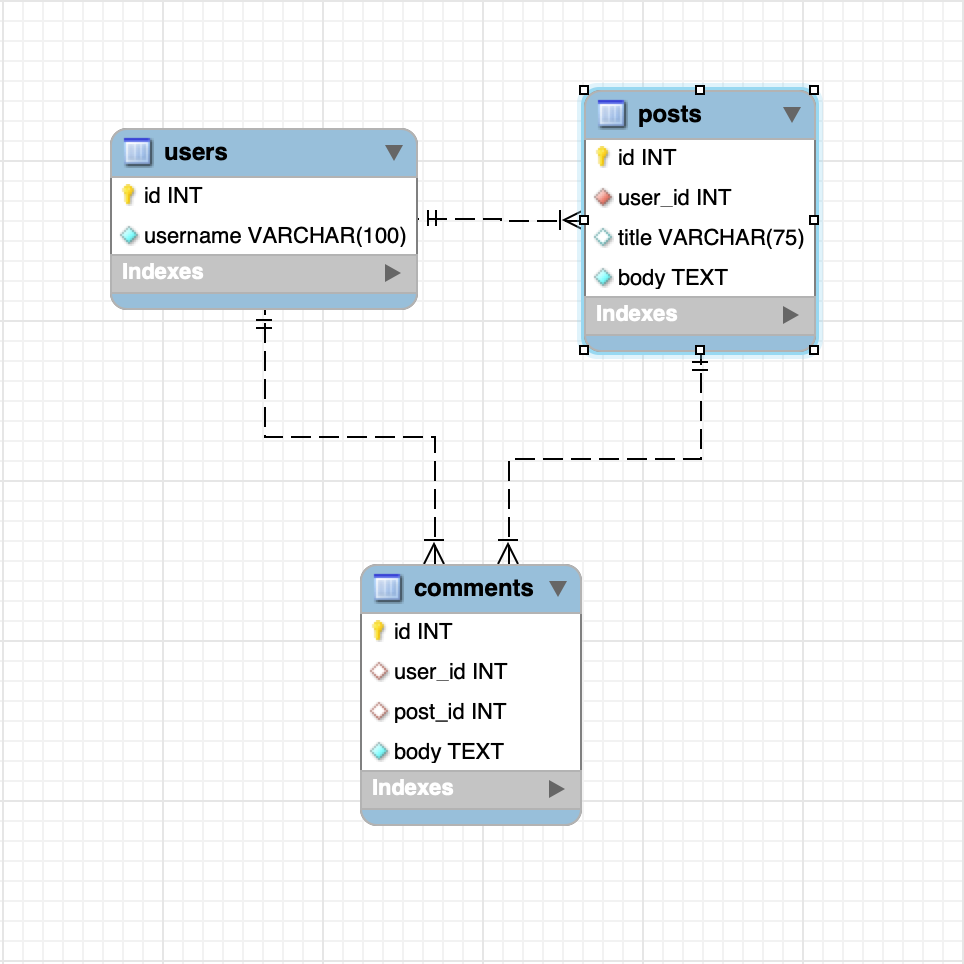

# SQUACKER MEDIA!

> A simple social media api

### initialize database
  * source db/schema.sql in the mysql terminal shell or mysql workbench

### configure the app
  * copy the `.env.EXAMPLE` variables into `.env` and fill out with your credentials
  * run command `npm install`

### seed the database
  * run command `npm run seed`

### import insomnia routes
  * import `./assets/squacker_insomnia_routes.json` into insomnia
  * [import docs](https://docs.insomnia.rest/insomnia/import-export-data#import-data)

### start the app
  * run command `npm run watch`

## high level schema overview
  * users
    - relationship: 'one-to-many' (one user can have many posts)
    - relationship: 'one-to-many' (one user can have many comments)
  * posts
    - relationship: 'many-to-one' (many posts belong to one user) - inverse side of one-to-many
    - relationship: 'one-to-many' (one post can have many comments)
  * comments
    - relationship: 'many-to-one' (many comments belong to one post)
    - relationship: 'many-to-one' (many comments belong to one user)

